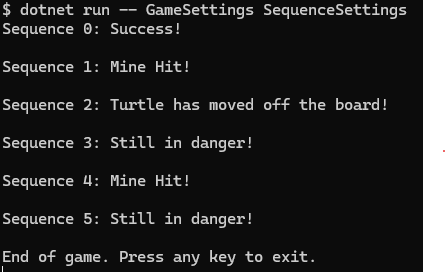

# Turtle Challenge

A turtle must walk through a minefield. 

The goal is to given a set of one or more sequences of moves the turtle should reach the exit.

You can see more information about it [here](https://s3-eu-west-1.amazonaws.com/lgc-public/TurtleChallenge.pdf)


## Project overview

This is a .NET Console Application that takes two file names as input arguments. 

The game settings file and the sequence of moves  file.

The application will execute sequence of moves and preform the moves operations on the turtle.
At the end of each sequence the result will be printed to the console. 

The choosen format of the files was JSON mainly because of its readability and ease of use.

### The Game Settings 

```json
{
  "size": {
    "width": 5,
    "height": 4
  },
  "startingPosition": {
    "x": 0,
    "y": 1
  },
  "startingDirection": "North",
  "exitPosition": {
    "x": 4,
    "y": 2
  },
  "mines": [
    {
      "x": 1,
      "y": 1
    },
    {
      "x": 3,
      "y": 1
    },
    {
      "x": 3,
      "y": 3
    }
  ]
}
```

We perform some validations on the Game Settings Json, for instance:
- We Validate that the Height and Width of the board cannot be lower or equal to 0
- We validate that the turtle initial position is not the as a mine or exit
- We validate that the turtle initial position is not outside of the board


### The Sequences of Moves

```json
{
  "Sequences": [
    ["m","r","m","m","m","m","r","m","m"],
    ["r","m"],
    ["m","m","m"],
    ["r","r","r"],
    ["q","r","m","e","r","q"],
    ["m","r","m","m","m","m","r","m"]
  ]
}
```

### Running the application

To run the application you just need to go the src/Challenge folder and execute the command

```bash
dotnet run -- GameSettings SequenceSettings
```

And you should be able to see something like this

